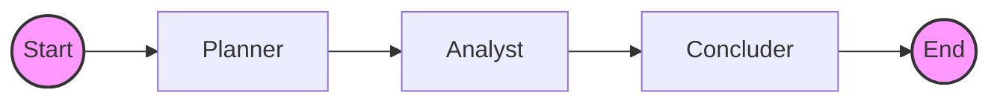
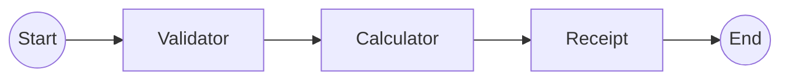
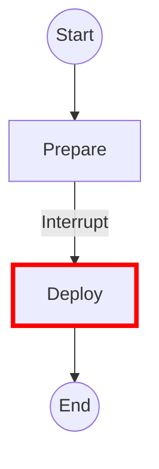
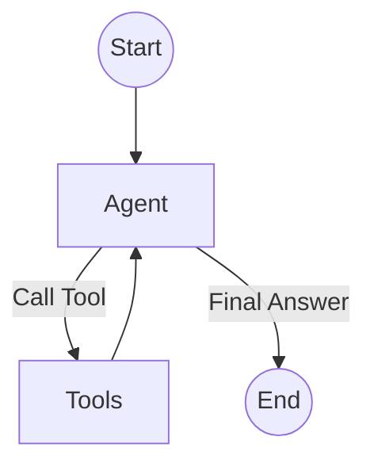
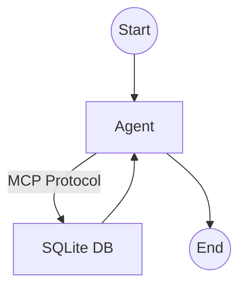
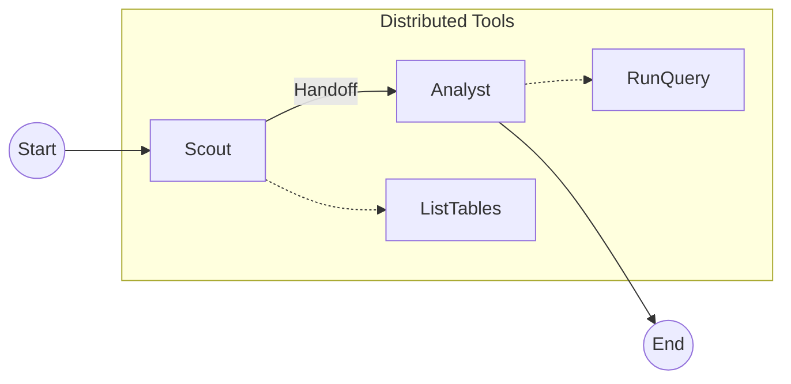
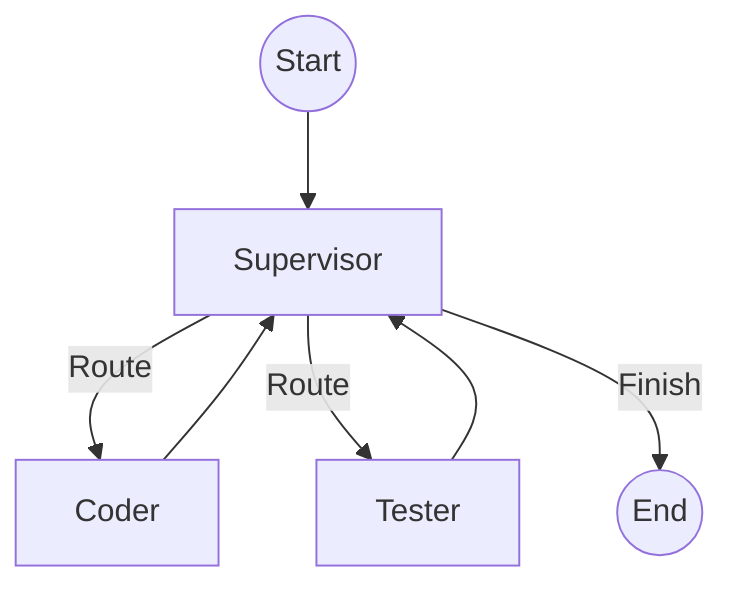
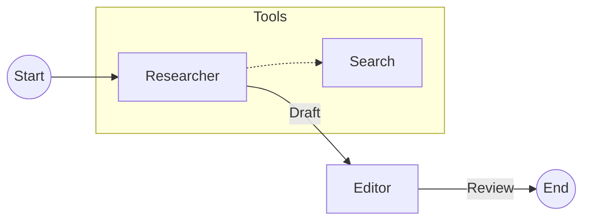

# 🦜🕸️ LangGraph Self-Paced Learning

[](https://langchain-ai.github.io/langgraph/)
[](https://www.python.org/)
[](https://deepmind.google/technologies/gemini/)

Welcome to the **Ultimate LangGraph 1.0 Course**! 🚀

This repository is designed to take you from a complete beginner to building production-ready **Autonomous Agents** using LangGraph and Google Gemini.

---

## 📚 How to Learn

This course follows a **"Learn by Doing"** philosophy. Each module is a self-contained mini-project.

1.  **Concept (`concept.md`)**: Read this first to understand the *theory*.
2.  **Project (`project.py`)**: Run this to see a *working example*.
3.  **Challenge (`challenge.py`)**: A broken/incomplete script. **Your job is to fix it!**
4.  **Solution (`solution.py`)**: Stuck? Check the reference answer.

---

## 🛠️ Setup

We use **[uv](https://github.com/astral-sh/uv)** for blazing fast dependency management.

1.  **Install uv**:
    ```bash
    # Windows
    powershell -c "irm https://astral.sh/uv/install.ps1 | iex"
    # macOS/Linux
    curl -LsSf https://astral.sh/uv/install.sh | sh
    ```

2.  **Install Dependencies**:
    ```bash
    uv sync
    ```

3.  **Set API Keys**:
    Rename `.env.example` to `.env` and add your **Google API Key**.
    ```bash
    cp .env.example .env
    # Edit .env and add GOOGLE_API_KEY=...
    ```

---

## 🗺️ Curriculum Overview

### 1. Foundations: Chain of Thought
**Folder:** `01-foundations`

Learn the basics of **Nodes**, **Edges**, and the **StateGraph**. We build a system that simulates a thinking process.



*   **Goal**: Pass a state dictionary through a sequence of functions.
*   **Run**: `uv run 01-foundations/project.py`

---

### 2. State Management: Order Bot
**Folder:** `02-state-management`

Master the `State` schema. Learn how to use **Reducers** (like `add_messages`) and handle complex data flow.



*   **Goal**: Validate an order, calculate the total, and print a receipt.
*   **Run**: `uv run 02-state-management/project.py`

---

### 3. Persistence: Support Bot
**Folder:** `03-persistence`

Add **Memory** to your agents! Learn about **Checkpointers** and **Thread IDs** to remember conversations across restarts.

```mermaid
graph TD
    START((Start)) --> Bot
    Bot --> END((End))
    
    subgraph "💾 MemorySaver"
    Bot
    end
```



*   **Goal**: A chatbot that remembers your name and issue even if you restart the script.
*   **Run**: `uv run 03-persistence/project.py`

---

### 4. Human-in-the-Loop: Deployment Manager
**Folder:** `04-human-in-the-loop`

Learn how to **Pause** execution for human approval using `interrupt_before` and resume with `Command`.



*   **Goal**: A deployment system that waits for you to type "yes" before "deploying" code.
*   **Run**: `uv run 04-human-in-the-loop/project.py`

---

### 5. Tool Use: Travel Agent
**Folder:** `05-tool-use`

Build a real **ReAct Agent**. Learn how to bind tools (functions) to an LLM and let it decide when to call them.



*   **Goal**: An agent that can search for flights (and weather in the challenge!).
*   **Run**: `uv run 05-tool-use/project.py`

---

### 6. MCP Integration: Database Analyst
**Folder:** `06-mcp-integration`

Connect your agent to the world using the **Model Context Protocol (MCP)**. We simulate a connection to a SQLite database.



*   **Goal**: An agent that can query a database to answer questions about users and orders.
*   **Run**: `uv run 06-mcp-integration/project.py`

---

### 7. Special Project: A2A + MCP
**Folder:** `07-special-project-a2a-mcp`

Combine **Agent-to-Agent** communication with **MCP** tools.
- **Scout**: Finds the table.
- **Analyst**: Queries the table.



*   **Goal**: A pipeline where one agent passes critical info to another to solve a task.
*   **Run**: `uv run 07-special-project-a2a-mcp/project.py`

---

### 8. Multi-Agent Orchestration: Dev Team
**Folder:** `08-multi-agent-orchestration`

Scale up! Coordinate multiple specialized agents using the **Supervisor Pattern**.



*   **Goal**: A "Supervisor" that manages a "Coder" and a "Tester" to write and verify code.
*   **Run**: `uv run 07-multi-agent-orchestration/project.py`

---

### 9. Capstone: Autonomous Researcher
**Folder:** `09-capstone-project`

The Final Boss. Combine everything you've learned into a single, powerful application.



*   **Goal**: An assistant that researches a topic, writes a draft, and asks for your approval before finalizing.
*   **Run**: `uv run 08-capstone-project/main.py`

---

## 🤝 Contributing

Feel free to open issues or PRs if you find bugs or want to add more challenges!

Happy Coding! 🤖
